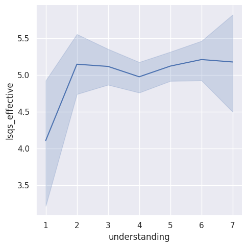
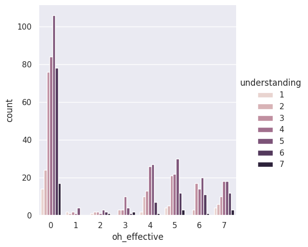
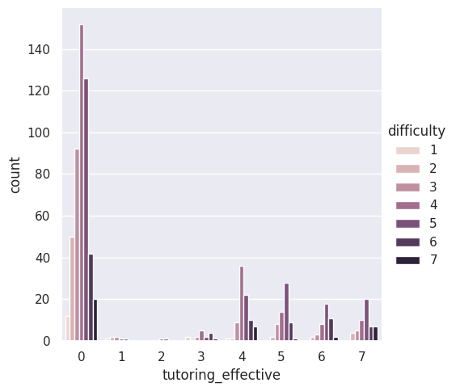

---
# Do not edit the text between these lines!
layout: default
---

# Should COMP110 have a weekly review session?

## Summary & Description of Analysis

My recommendation is that the course should offer weekly review session. These sessions will allow for structured review and application of material, especially for students who struggle with understanding or work better in group settings. My analysis supports this change by showing that students who find the class difficult also tend to benefit more from structured support.

My first analysis compared the average understanding of beginners to students with prior coding experience. Overall, students with more experience found the class easier. This supports my recommendation because it suggests that beginners would benefit from the extra support to help close gap between students with prior experience. 

My second analysis examined the perceiced difficulty of class based on usage of office hours and tutoring. The results showed that students who find the class more difficult are also more likely to find the extra support useful. Students reporting lower difficulty showed lower engagement with these resources, which may have influenced their perception of effectiveness.

My third analysis calculated the average effectiveness ratinf of lesson videos, post lesson questions, and tutoring sessions. Overall, lesson videos, post lesson questions and quiz questions had like levels of effectiveness with an average effectiveness around 5. However, tutoring was deemed inefficient with an average rating around 1. 

Overall, this analysis suggests that students find the structured practice problems helpful for guiding their understanding. As a result, they would likely benefit from additional problems that help further develop their knowledge and challenge the skills built in class. A further extension of this question could ask students can create their own problems rather then if they do currently. One could also add a survey question to see if students would attend a group session and if they believe it would be helpful. A tradeoff of this would it would require that students be able to attend the weekly session which could be hard with the busy schedules students have. This could be substitued by posting the problem sets on a canvas website. Also, it would require someone in the comp department to take on the job of running the sessions.

## Graphs
Effectiveness of Post Lesson Questions vs. Understanding

Office Hours Effectiveness Varation with Difficulty

Tutoring Effectiveness Varation with Difficulty

